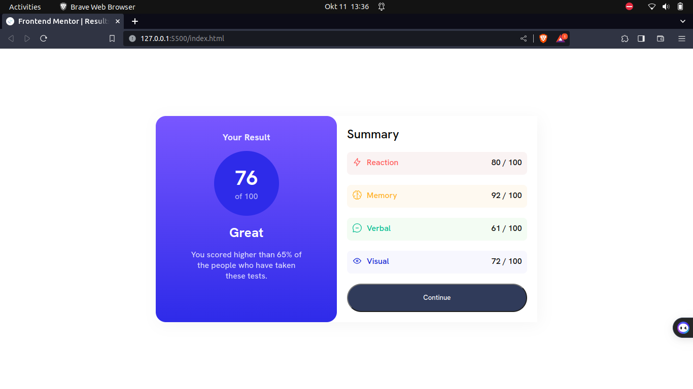
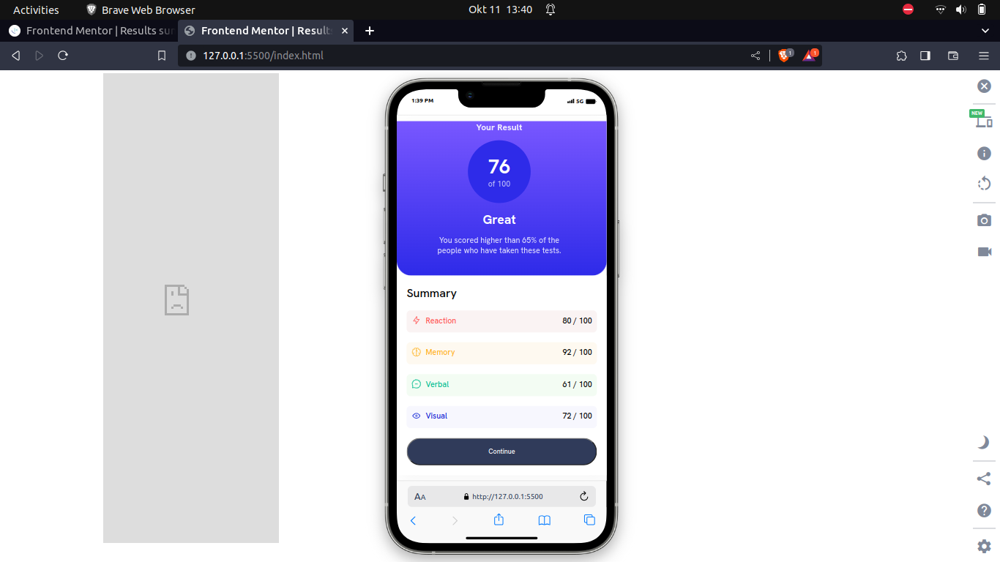

# Frontend Mentor - Results summary component solution

This is a solution to the [Results summary component challenge on Frontend Mentor](https://www.frontendmentor.io/challenges/results-summary-component-CE_K6s0maV). Frontend Mentor challenges help you improve your coding skills by building realistic projects. 

## Table of contents

- [Overview](#overview)
  - [The challenge](#the-challenge)
  - [Screenshot](#screenshot)
  - [Links](#links)
- [My process](#my-process)
  - [Built with](#built-with)
  - [What I learned](#what-i-learned)
  - [Continued development](#continued-development)
  - [Useful resources](#useful-resources)
- [Author](#author)

## Overview

### The challenge

Users should be able to:

- View the optimal layout for the interface depending on their device's screen size
- See hover and focus states for all interactive elements on the page
### Screenshot






### Links

- Solution URL: [Add solution URL here](https://your-solution-url.com)
- Live Site URL: [Add live site URL here](https://your-live-site-url.com)

## My process

### Built with

- Semantic HTML5 markup
- CSS custom properties
- Flexbox
- Mobile-first workflow


### What I learned


Responsive web design for mobile devices.

Using the opacity property on text to make it lighter.
```css

.result-header{
    font-size: 18px;
    font-weight: 800;
    opacity: 0.87;
}
```

Using rem instead of pixels to specify the height and width to make the design seamless between devices of different screen sizes.

```css
.result-score{
    width: 8rem;
    height: 8rem;
    border-radius: 50%;
    background: hsl(241, 81%, 54%);
    display: flex;
    justify-content: center;
    align-items: center;

}
```
```css
```


Using padding and margin carefully to avoid containers spilling out of their  parent containers. And using the box-sizing property to also control spilling.

```css
@media  only screen and (max-width:600px) {
   .result-container{
        width: 100%;
        border-radius: 0 0 30px 30px;
        box-sizing: border-box;
        gap: 1rem;
        padding: 0 40px 40px 30px;
    }
   
}
```


### Continued development


I would want to continue in the area of responsive web development and especially focus on mobile first design.


### Useful resources

- [Example resource 1](https://www.example.com) - This helped me for XYZ reason. I really liked this pattern and will use it going forward.
- [Example resource 2](https://www.example.com) - This is an amazing article which helped me finally understand XYZ. I'd recommend it to anyone still learning this concept.


## Author

- Website - Rose Kimu
- Frontend Mentor - [@yourusername](https://www.frontendmentor.io/profile/yourusername)
- Twitter - [@yourusername](https://www.twitter.com/yourusername)


